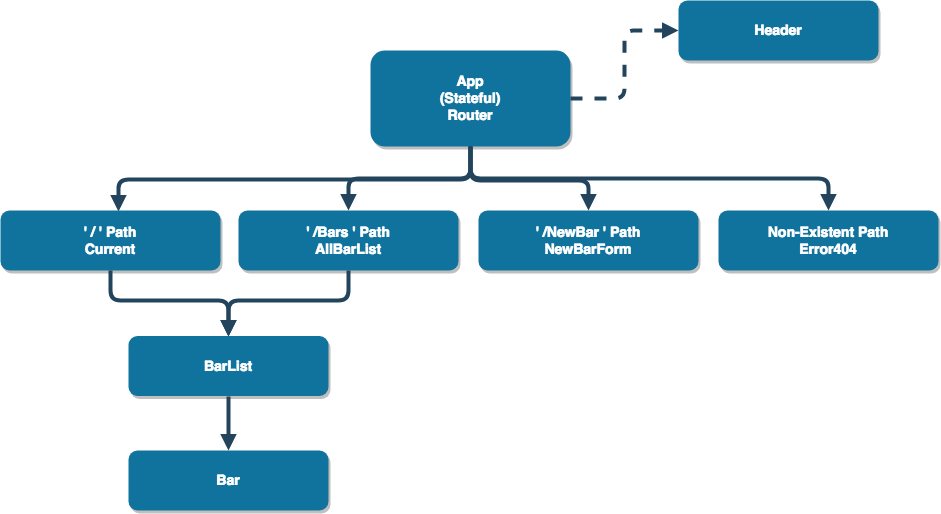

# Help Me, I'm Pour

#### A happy hour finder app built in React with a custom java server, July 2018

#### By Garnett Puett

<a href='https://github.com/gpuett/im-pour-java-server'>Java Server Github Link</a>

## Description
A web application built with React, this happy hour finder lets financially frugal Portlanders find cheap libations.

## Setup/Installation Requirements

## MVP Feature List
 - [x] Custom server to store/edit/delete happy hour information by bar
 - [x] User interface to view and add happy hour information
 - [x] Local time cross reference to list all current details

## Future Feature List
* User authentication for:
  * Administrative route to edit and delete outdated happy hour information
  * User profiles to comment, like, and share deals
* React Native support

### Component Structure

## Known Bugs
No known bugs at this time.

## Technologies Used
* Front End
  * React
  * React Router
* Back End
  * Java
  * Spark
  * SQL
  * Gradle/Maven

## Support and contact details

_Feel free to email me at gpuett@gmail.com for comments or concerns._

### License

*This software is licensed under the MIT license*

Copyright &copy; 2018 **Garnett Puett**
